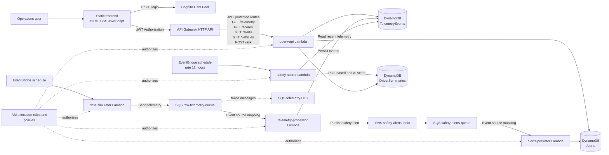

# Smart Fleet Hub Architecture

## System Diagram

## Runtime Flows

### 1. Authentication and dashboard access

1. The browser loads the static dashboard from the frontend hosting layer.
2. `frontend/auth.js` performs Cognito authentication using a PKCE verifier and challenge.
3. Tokens are stored in the browser and refreshed when needed.
4. `frontend/script.js` sends the access token in the `Authorization` header.
5. API Gateway validates the JWT before invoking `query-api`.

### 2. Telemetry ingestion

1. The scheduled `data-simulator` Lambda generates vehicle telemetry.
2. It publishes messages to `raw-telemetry-queue`.
3. `telemetry-processor` is invoked from SQS in batches.
4. The processor writes telemetry events to the `TelemetryEvents` DynamoDB table.
5. Messages that fail processing three times are moved to the telemetry DLQ.

### 3. Safety scoring and alerting

1. `safety-scorer` reads recent telemetry from DynamoDB.
2. It calculates a rule-based safety score and can request an AI score.
3. Scores are stored in the `DriverSummaries` DynamoDB table.
4. Safety alerts are published to the `safety-alerts-topic` SNS topic.
5. SNS delivers alerts to `safety-alerts-queue`.
6. `alerts-persister` consumes that queue and writes alerts to DynamoDB.

### 4. Dashboard queries

The HTTP API exposes the browser-facing query surface:

- `GET /telemetry`
- `GET /scores`
- `GET /alerts`
- `GET /vehicles`
- `POST /ask`

All routes use the Cognito JWT authorizer and share the `query-api` Lambda integration. The dashboard refresh cycle loads the data, sorts telemetry, renders scores and alerts, and updates summary statistics.

## Deployment Boundaries

- **Frontend:** Static assets in `frontend/`, served through the Terraform-managed hosting and CDN resources.
- **API:** API Gateway HTTP API with a JWT authorizer and Lambda proxy integration.
- **Compute:** Independent Node.js 20 Lambda functions under `lambdas/`.
- **Messaging:** SQS provides buffering and retries; SNS fans safety alerts into the alert queue.
- **Persistence:** DynamoDB stores telemetry, scores, and alerts.
- **Security:** Cognito authenticates users; IAM roles authorize Lambda access to AWS services.
- **Operations:** Terraform manages AWS resources, scheduled invocations, Lambda event source mappings, permissions, DLQ behavior, and monitoring.

## Source Map

| Concern                              | Implementation                                                               |
| ------------------------------------ | ---------------------------------------------------------------------------- |
| Browser authentication               | [frontend/auth.js](frontend/auth.js)                                         |
| Dashboard behavior and API calls     | [frontend/script.js](frontend/script.js)                                     |
| Telemetry generation                 | [lambdas/data-simulator/index.ts](lambdas/data-simulator/index.ts)           |
| Telemetry processing                 | [lambdas/telemetry-processor/index.ts](lambdas/telemetry-processor/index.ts) |
| Safety scoring                       | [lambdas/safety-scorer/index.ts](lambdas/safety-scorer/index.ts)             |
| Alert persistence                    | [lambdas/alerts-persister/index.ts](lambdas/alerts-persister/index.ts)       |
| Query endpoints                      | [lambdas/query-api/index.ts](lambdas/query-api/index.ts)                     |
| API routes and JWT authorizer        | [terraform/apigateway.tf](terraform/apigateway.tf)                           |
| Queues and DLQ                       | [terraform/sqs.tf](terraform/sqs.tf)                                         |
| Alert topic and subscription         | [terraform/sns.tf](terraform/sns.tf)                                         |
| DynamoDB tables                      | [terraform/dynamodb.tf](terraform/dynamodb.tf)                               |
| Lambda deployment and event bindings | [terraform/](terraform/)                                                     |
